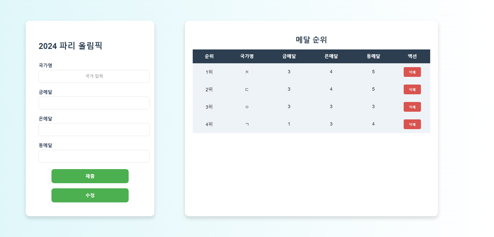

# 🏅 **올림픽 메달의 개수** 🏅

**국가별 올림픽 메달 정보를 입력, 수정, 삭제할 수 있는 반응형 웹 애플리케이션입니다.**  
사용자 친화적인 인터페이스와 깔끔한 디자인으로 메달 현황을 한눈에 확인하세요!

---

## 📸 **스크린샷**

<p align="center">  </p>

---

## ✨ **주요 기능**

- 🏆 **국가별 메달 입력** – 국가별 금, 은, 동 메달 수를 추가합니다.
- ✏️ **국가별 메달 수정 및 삭제** – 기존 국가 데이터를 수정하거나 삭제할 수 있습니다.
- 📱 **반응형 웹 디자인** – 다양한 화면 크기에서 최적의 UI 제공.

---

## 🛠 **기술 스택**

| 제목         | 내용                             |
| ------------ | -------------------------------- |
| **React**    | UI 구축 및 상태 관리             |
| **Vite**     | 빠른 개발 환경 설정              |
| **CSS**      | 스타일링 및 반응형 레이아웃 적용 |
| **ESLint**   | 코드 품질 유지 및 검사           |
| **Prettier** | 코드 포맷팅 자동화               |

---

## 🚀 **설치 및 실행 방법**

### 1. 프로젝트 클론

```bash
 git clone https://github.com/sharet9446/Number-Of-Olympic-Medals.git
 cd NUMBER-OF-OLYMPIC-MEDALS
```

### 2. 패키지 설치

```bash
 yarn install
```

### 3. 로컬 서버 실행

```bash
 yarn dev
```

- 이후 브라우저에서 http://localhost:5173로 접속하세요.

---

## 📂 **프로젝트 폴더 구조**

```lua
NUMBER-OF-OLYMPIC-MEDALS
│-- node_modules/
│-- public/
│-- src/
│   ├── assets/              # 정적 파일 (이미지, 로고 등)
│   ├── components/          # 재사용 가능한 UI 컴포넌트
│   │   ├── Form.jsx
│   │   └── List.jsx
│   ├── App.jsx              # 메인 애플리케이션 컴포넌트
│   ├── App.css              # 전역 스타일링
│   ├── index.css            # 메인 스타일 시트
│   ├── main.jsx              # 엔트리 포인트
│-- .gitignore
│-- .prettierrc               # Prettier 설정
│-- eslint.config.js          # ESLint 설정
│-- image.png                 # 프로젝트 스크린샷
│-- index.html                # 기본 HTML 템플릿
│-- package.json              # 프로젝트 메타정보 및 의존성
│-- README.md                 # 프로젝트 문서
│-- vite.config.js             # Vite 설정 파일
│-- yarn.lock                  # Yarn 의존성 버전 관리

```

---

## 📋 **사용법**

1.  국가 이름과 메달 개수를 입력 후 "제출" 버튼 클릭.
2.  국가별 메달 정보를 클릭하여 수정 가능.
3.  삭제 버튼을 눌러 특정 국가의 정보를 삭제.
